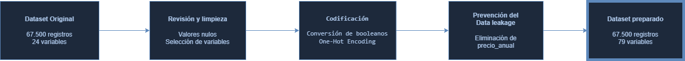
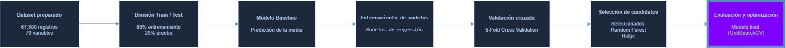

<p align="center">
  
</p>

# 🐾 Proyecto Machine Learning - Predicción del Precio de Seguros para Mascotas

> Proyecto desarrollado como parte del **Bootcamp de Data Science de The Bridge**.

📎 **Continuación del proyecto EDA**

Este proyecto constituye la segunda fase del trabajo desarrollado en el **Análisis Exploratorio de Datos (EDA)** sobre cotizaciones de seguros para mascotas.

Durante el EDA se estudiaron la calidad del conjunto de datos, las relaciones entre las variables y los principales factores asociados al precio de las cotizaciones. A partir de esos resultados, en esta segunda fase se desarrolla un modelo de **Machine Learning supervisado** capaz de estimar el precio mensual de una nueva cotización e identificar las variables con mayor influencia en dicho cálculo.


---
>
># 📖 1. Introducción
>

Este proyecto desarrolla un modelo de **Machine Learning supervisado** para la predicción del **precio mensual de los seguros para mascotas**, utilizando un conjunto de datos compuesto por **67.500 cotizaciones** proporcionadas por una empresa del sector asegurador con fines exclusivamente académicos.

El trabajo constituye la continuación del proyecto de **Análisis Exploratorio de Datos (EDA)**, donde se analizaron la calidad del conjunto de datos, la distribución de las variables y los factores con mayor influencia sobre el precio de las cotizaciones. Los resultados obtenidos durante esa primera fase sirvieron como base para definir la estrategia de preprocesamiento y modelado aplicada en este proyecto.

En esta segunda etapa se implementa un flujo completo de Machine Learning que abarca la preparación de los datos, el entrenamiento de diferentes modelos de regresión, la evaluación mediante métricas objetivas y la optimización del modelo con mejor rendimiento. Todo ello con el propósito de obtener una solución predictiva robusta y facilitar la comprensión de los factores que influyen en el cálculo del precio del seguro.

Además de desarrollar un modelo con una elevada capacidad predictiva, el proyecto busca aportar información útil para el negocio, permitiendo identificar las variables más relevantes en el proceso de tarificación y proporcionando una herramienta de apoyo para la toma de decisiones basada en datos.

---

>
># 🎯 2. Objetivo del proyecto
>

El objetivo principal de este proyecto es desarrollar un **modelo supervisado de regresión** capaz de estimar el **precio mensual** de nuevas cotizaciones de seguros para mascotas, proporcionando además información que permita comprender los factores que más influyen en el cálculo del precio.

Para alcanzar este objetivo, se plantearon los siguientes objetivos específicos:

- Construir un pipeline completo de Machine Learning para el entrenamiento y evaluación de modelos predictivos.
- Preparar y transformar el conjunto de datos para obtener un dataset consistente y apto para el aprendizaje automático.
- Comparar distintos algoritmos de regresión utilizando una metodología homogénea de evaluación.
- Evaluar el rendimiento de cada modelo mediante métricas objetivas (**MAE**, **RMSE** y **R²**).
- Seleccionar el modelo con mejor rendimiento y comprobar su capacidad de generalización sobre datos no utilizados durante el entrenamiento.
- Identificar las variables con mayor influencia sobre el precio del seguro para facilitar la interpretación del modelo y apoyar la toma de decisiones del negocio.
- Seleccionar el modelo que ofrezca el mejor equilibrio entre capacidad predictiva, generalización e interpretabilidad.

---

>
># 💼 3. Problema de negocio
>

Las compañías aseguradoras necesitan establecer precios competitivos y coherentes para sus productos, garantizando al mismo tiempo la sostenibilidad del negocio y una correcta evaluación del riesgo asociado a cada póliza.

En el caso de los seguros para mascotas, el precio de una cotización depende de múltiples factores relacionados con las características del animal, las coberturas contratadas y la localización geográfica del asegurado. Esta combinación de variables dificulta comprender el impacto individual de cada una sobre el precio final y limita la capacidad para analizar el proceso de tarificación de forma objetiva.

Durante el proyecto de **Análisis Exploratorio de Datos (EDA)** se identificaron las variables con mayor relación respecto al precio de las cotizaciones. Sin embargo, dicho análisis no permitía realizar predicciones para nuevas solicitudes ni cuantificar con precisión la contribución conjunta de todas las variables.

Para dar respuesta a esta necesidad, en este proyecto se desarrolla un modelo de **Machine Learning supervisado** capaz de estimar el **precio mensual** de nuevas cotizaciones a partir de sus características, proporcionando además información sobre la importancia relativa de las variables utilizadas durante el proceso de predicción.

La solución propuesta permite disponer de una herramienta de apoyo para la toma de decisiones, facilitando tanto la estimación de nuevas cotizaciones como la comprensión de los factores que más influyen en el cálculo del precio del seguro.

---

>
># 📊 4. Dataset
>

El proyecto utiliza un conjunto de datos de **cotizaciones de seguros para mascotas**, proporcionado por una empresa del sector asegurador con fines exclusivamente académicos.

El dataset original está compuesto por **67.500 registros** y **24 variables**, que recogen información relacionada con las características de la mascota, las coberturas contratadas y la localización geográfica del asegurado.

Entre las variables más relevantes se encuentran:

- Especie de la mascota.
- Raza y grupo racial.
- Edad.
- Sexo.
- Estado de esterilización.
- Raza pura.
- Clasificación de peligrosidad.
- Código postal y municipio.
- Plan contratado.
- Capital veterinario.
- Cobertura de responsabilidad civil.
- Precio mensual.
- Precio anual.

## 🎯 Variable objetivo

La variable objetivo seleccionada para el desarrollo del modelo es **`precio_mensual`**, ya que representa el importe de la cotización que la empresa desea estimar para nuevas solicitudes.

Por el contrario, la variable **`precio_anual`** fue excluida del entrenamiento al tratarse de una transformación directa del precio mensual, lo que habría introducido **data leakage** y generado estimaciones artificialmente optimistas.

## 📈 Transformación del dataset

Tras el proceso de preparación de los datos, el conjunto utilizado para el modelado conserva los **67.500 registros** originales y pasa de **24 variables** a **79 variables**, como resultado del proceso de limpieza, selección de variables y codificación mediante **One-Hot Encoding**, obteniendo un conjunto de datos preparado para el entrenamiento de los modelos de Machine Learning.

---

>
># 🛠️ 5. Tecnologías utilizadas
>

El desarrollo del proyecto se llevó a cabo utilizando las siguientes herramientas y librerías:

| Tecnología | Uso en el proyecto |
|------------|--------------------|
| **Python 3.11** | Lenguaje principal para el desarrollo del proyecto. |
| **Pandas** | Manipulación, limpieza y transformación de datos. |
| **NumPy** | Operaciones numéricas y procesamiento matricial. |
| **Scikit-learn** | Preprocesamiento, entrenamiento de modelos, validación cruzada y cálculo de métricas de evaluación. |
| **Matplotlib** | Visualización de resultados y generación de gráficos. |
| **Seaborn** | Visualización estadística durante el análisis exploratorio y la evaluación de resultados. |
| **Joblib** | Persistencia y carga de los modelos entrenados (.pkl). |
| **Jupyter Notebook** | Desarrollo y documentación del flujo completo del proyecto. |
| **Visual Studio Code** | Entorno de desarrollo utilizado durante la implementación. |
| **Git** | Control de versiones del proyecto. |
| **GitHub** | Gestión del repositorio y trabajo colaborativo mediante ramas y Pull Requests. |

---

>
># ⚙️ 6. Preparación de los datos
>

Antes del entrenamiento de los modelos fue necesario realizar un proceso de preparación del conjunto de datos para garantizar su calidad y evitar posibles sesgos durante el aprendizaje.


<p align="center">

</p>


El pipeline de preprocesamiento incluyó las siguientes etapas:

- **Selección de variables**: se eliminaron identificadores técnicos y variables sin capacidad predictiva, así como aquellas que podían introducir redundancia o *data leakage*.
- **Tratamiento de valores faltantes**: los valores nulos se gestionaron según la naturaleza de cada variable, preservando la coherencia con la lógica del negocio.
- **Codificación de variables categóricas**: las variables categóricas se transformaron mediante **One-Hot Encoding**, permitiendo que pudieran ser utilizadas por los modelos de Machine Learning.
- **Definición de la variable objetivo**: se seleccionó `precio_mensual` como variable a predecir, eliminando `precio_anual` para evitar *data leakage* durante el entrenamiento.
- **Preparación del conjunto final**: tras las transformaciones, el dataset pasó de **24 variables originales** a **79 variables**, manteniendo los **67.500 registros** disponibles para el entrenamiento del modelo. 

Como resultado de este proceso se obtuvo un conjunto de datos limpio, consistente y preparado para la fase de modelado.

### 📌 Resumen del preprocesamiento

| Etapa | Resultado |
|-------|-----------|
| Registros iniciales | 67.500 |
| Variables originales | 24 |
| Variable objetivo | `precio_mensual` |
| Variable eliminada por Data Leakage | `precio_anual` |
| Variables finales | 79 |
| Registros finales | 67.500 |

---

>
># 🤖 7. Modelado
>

Una vez preparado el conjunto de datos, se procedió al entrenamiento y comparación de distintos modelos de regresión con el objetivo de seleccionar la alternativa con mejor capacidad predictiva.

<p align="center">

</p>

La estrategia de modelado siguió un flujo de trabajo común para todos los algoritmos, garantizando una comparación objetiva de su rendimiento.

Las principales etapas fueron:

- **División del dataset**: el conjunto de datos se dividió en entrenamiento (80%) y prueba (20%), reservando el conjunto de test exclusivamente para la evaluación final del modelo.
- **Modelo Baseline**: se utilizó un `DummyRegressor` como referencia inicial para establecer un punto de comparación frente a los modelos de Machine Learning.
- **Entrenamiento de modelos**: se entrenaron distintos algoritmos de regresión utilizando exactamente el mismo conjunto de entrenamiento.
- **Validación cruzada**: todos los modelos fueron evaluados mediante validación cruzada de 5 particiones (*5-Fold Cross Validation*), obteniendo métricas comparables y reduciendo la dependencia de una única partición de los datos.
- **Persistencia de modelos**: los modelos entrenados fueron almacenados para su posterior análisis y evaluación en la fase final del proyecto.

### 📋 Modelos entrenados y comparados

Durante esta fase se compararon los siguientes modelos:

| Modelo | Objetivo |
|---------|----------|
| **Baseline (DummyRegressor)** | Establecer una referencia mínima de rendimiento. |
| **Regresión Lineal** | Modelo lineal base para la predicción del precio. |
| **Ridge** | Regresión lineal con regularización L2. |
| **Lasso** | Regresión lineal con regularización L1 y selección de variables. |
| **Elastic Net** | Combinación de regularización L1 y L2. |
| **Random Forest Regressor** | Modelo basado en árboles de decisión para capturar relaciones no lineales. |

Todos los modelos fueron evaluados utilizando la misma metodología y las mismas métricas de rendimiento (**MAE**, **RMSE** y **R²**), permitiendo realizar una comparación homogénea antes de seleccionar el modelo final.

---

>
># 📈 8. Evaluación y selección del modelo
>

Tras el entrenamiento de los distintos modelos de regresión, se llevó a cabo una evaluación comparativa para seleccionar la alternativa con mejor capacidad predictiva.

La evaluación se realizó en dos fases:

1. **Comparación inicial mediante validación cruzada**, utilizando el conjunto de entrenamiento para analizar el comportamiento de todos los modelos bajo las mismas condiciones.
2. **Evaluación final sobre el conjunto de prueba**, empleando datos no utilizados durante el entrenamiento para comprobar la capacidad de generalización del modelo seleccionado.

## Métricas de evaluación

Para comparar el rendimiento de los modelos se utilizaron las siguientes métricas:

- **MAE (Mean Absolute Error):** mide el error absoluto medio entre las predicciones y los valores reales.
- **RMSE (Root Mean Squared Error):** penaliza especialmente los errores de mayor magnitud.
- **R² (Coeficiente de determinación):** indica la proporción de la variabilidad del precio explicada por el modelo.

## Selección del modelo

La comparación entre modelos permitió identificar **Random Forest Regressor** como la alternativa con mejor rendimiento predictivo. El modelo seleccionado fue posteriormente evaluado sobre el conjunto de prueba, utilizando datos no empleados durante el entrenamiento, con el objetivo de comprobar su capacidad de generalización.

Finalmente, el modelo seleccionado se evaluó utilizando el conjunto de prueba, lo que evidenció una adecuada capacidad de generalización.

## Validación del modelo

Además de las métricas tradicionales, se realizaron comprobaciones adicionales para garantizar la fiabilidad de los resultados obtenidos:

- Se verificó el rendimiento del modelo sobre datos completamente no vistos durante el entrenamiento.
- Se comprobó el comportamiento del modelo utilizando únicamente variables básicas de la mascota y la póliza, obteniendo también una elevada capacidad predictiva.
- Se revisó la ausencia de registros duplicados o casi duplicados que pudieran generar resultados artificialmente optimistas.

Estas comprobaciones permitieron concluir que el elevado rendimiento obtenido responde al carácter altamente determinista del sistema de tarificación utilizado para generar las cotizaciones, y no a un problema de sobreajuste del modelo.

---

>
>## 📁 9. Estructura del repositorio
>

El proyecto se encuentra organizado siguiendo una estructura modular que facilita la comprensión del flujo de trabajo, la reutilización del código y el trabajo colaborativo.

```text
📦 proyecto-ml-seguros-mascotas
│
├── 📂 src
│   ├── 📂 data_sample          # Muestra del dataset
│   ├── 📂 img                  # Imágenes utilizadas en el README
│   ├── 📂 models               # Modelos entrenados (.pkl)
│   ├── 📂 notebooks
│   │   ├── 01_preprocessing.ipynb
│   │   ├── 02_modeling.ipynb
│   │   └── 03_evaluation.ipynb
│   └── 📂 utils                # Funciones auxiliares
│
├── 📄 main.ipynb               # Ejecución completa del proyecto
├── 📄 Presentation.pdf         # Presentación final
├── 📄 README.md
├── 📄 requirements.txt
└── 📄 .gitignore
```

## Notebooks del proyecto

| Notebook | Descripción |
|-----------|-------------|
| **01_preprocessing.ipynb** | Limpieza, transformación y preparación del conjunto de datos para el entrenamiento. |
| **02_modeling.ipynb** | Entrenamiento, validación cruzada y comparación de los distintos modelos de regresión. |
| **03_evaluation.ipynb** | Comparación final de modelos, selección del mejor modelo, evaluación sobre el conjunto de prueba y análisis de resultados. |
| **main.ipynb** | Notebook integrador que permite ejecutar el flujo completo del proyecto de principio a fin. |

---

>
># 💻 10. Instalación y ejecución
>

## 1. Clonar el repositorio

```bash
git clone https://github.com/Angelica26-DS/proyecto-ml-seguros-mascotas.git
```

## 2. Acceder al proyecto

```bash
cd proyecto-ml-seguros-mascotas
```

## 3. Crear un entorno virtual (opcional pero recomendado)

```bash
python -m venv .venv
```

### Windows

```bash
.venv\Scripts\activate
```

### Linux / macOS

```bash
source .venv/bin/activate
```

## 4. Instalar las dependencias

```bash
pip install -r requirements.txt
```
> **Nota sobre el modelo final**
>
> El modelo seleccionado durante el proyecto se genera automáticamente al ejecutar el notebook `03_evaluation.ipynb` y se guarda en la carpeta `src/models/` con el nombre `modelo_final.pkl` mediante `joblib.dump()`.

## 5. Ejecutar el proyecto

El proyecto puede ejecutarse de dos formas:

- Abrir **main.ipynb** para recorrer el flujo completo del proyecto.
- Ejecutar individualmente los notebooks de preprocesamiento, modelado y evaluación para analizar cada fase del desarrollo.

---

>
># 👥 11. Autores
>

Este proyecto fue desarrollado como parte del **Bootcamp de Data Science** por:

| Integrante | Rol | GitHub |
|------------|-----|--------|
| **Angélica Sánchez** | Preprocesamiento, ingeniería de variables, documentación y coordinación del proyecto | [@Angelica26-DS](https://github.com/Angelica26-DS) |
| **Hugo Zans** | Modelado y entrenamiento de modelos de Machine Learning | [@hugosanz1222-cloud](https://github.com/hugosanz1222-cloud) |
| **Carlos Sancho** | Evaluación, optimización y análisis del modelo final | [@csanchosahun](https://github.com/csanchosahun) |

---

>
># 🚀 Próximas mejoras
>

Como posibles líneas de trabajo futuras se plantean:

- Optimizar los hiperparámetros de Random Forest mediante **GridSearchCV** o **RandomizedSearchCV** con validación cruzada.
- Incorporar nuevos algoritmos de Machine Learning para comparar su rendimiento.
- Analizar la importancia de las variables mediante técnicas adicionales de interpretabilidad.
- Evaluar el comportamiento del modelo con datos reales de producción.
- Desarrollar una API para realizar predicciones sobre nuevas cotizaciones.
- Automatizar el pipeline completo de entrenamiento y evaluación.

---

>
>## 🙌 Agradecimientos
>
Este proyecto fue desarrollado como parte del **Bootcamp de Data Science de The Bridge**.

Agradecemos al equipo docente por el acompañamiento durante el desarrollo del proyecto y a la empresa colaboradora por facilitar el conjunto de datos utilizado con fines exclusivamente académicos.

---

⭐ **Si este proyecto te ha resultado interesante, no olvides dejar una estrella en el repositorio.**
